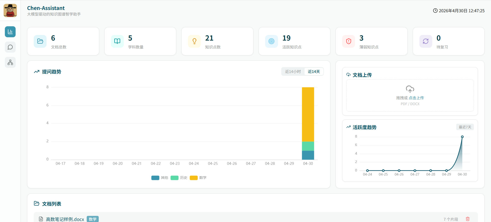
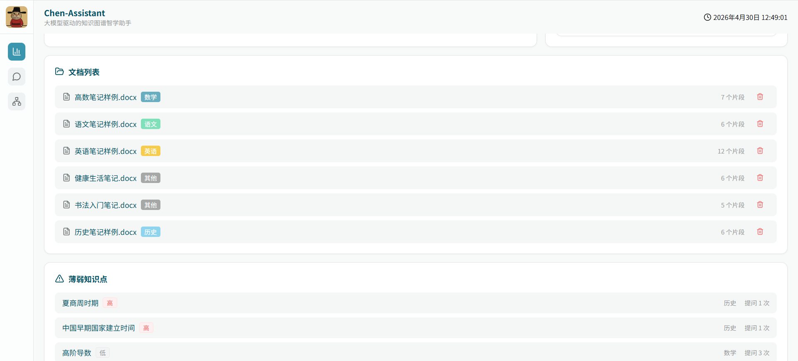
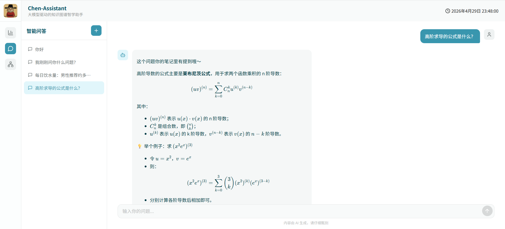
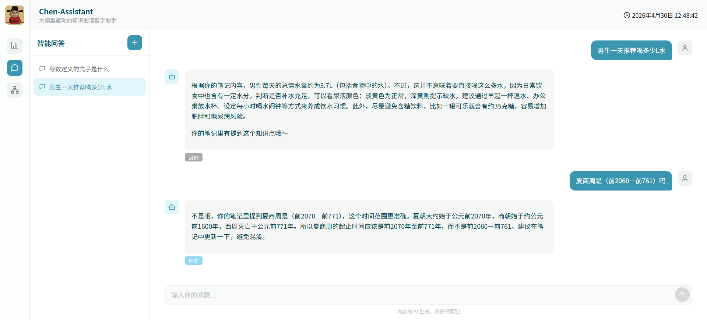
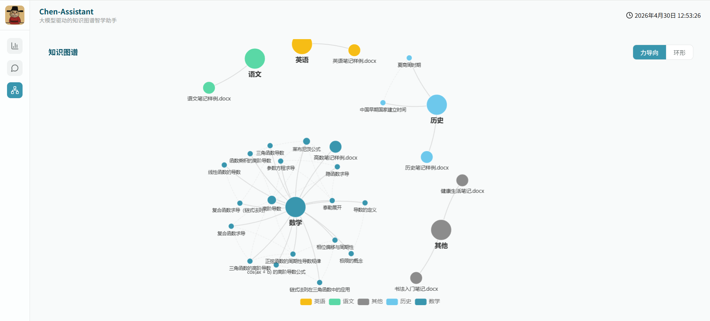
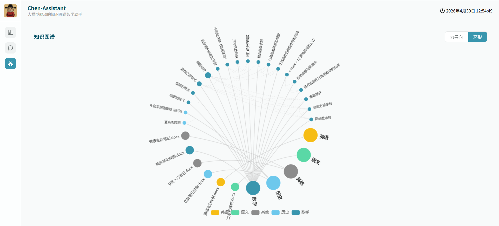

# 知识图谱智学助手 (Chen-Assistant)

基于上传的学习笔记，通过大模型 API 与 LangChain Chain 实现知识抽取、检索及智能问答，结合 Chroma 向量库自动识别薄弱知识点并推送关联内容，辅助高效学习。

## ✨ 核心特性

- **智能问答** — LangChain Chain 驱动，1 次 LLM 调用完成知识检索 + 结构化回答，支持多轮对话记忆与摘要压缩
- **文档管理** — PDF/DOCX 上传解析，中文标点智能切片，Chunk 级增量去重，自动学科识别
- **学习分析** — 薄弱知识点自动识别（时间衰减），活跃度趋势统计，复习建议推送
- **知识图谱** — 学科 → 文档 → 知识点三层图谱，共现关联，ECharts 力导向/环形布局
- **笔记纠错** — 自动指出笔记中的错误并给出正确解释，缺失知识点提醒补充
- **LaTeX 渲染** — 问答输出支持数学公式 + Markdown 实时渲染

## 🚀 快速开始

克隆代码，并初始化

```bash
git clone https://github.com/Chener0121/Chen-Assistant-main.git
cd Chen-Assistant
```

启动后端服务

```bash
# Windows PowerShell
cd backend
uv sync
uv run python main.py
```

启动前端服务

```bash
# Windows PowerShell
cd frontend
npm install
npm run dev
```

等待启动完成后，访问 http://localhost:5173

> **首次使用请先上传学习笔记（PDF/DOCX），否则问答和仪表盘无数据。**

后端 API 文档：http://127.0.0.1:8000/docs

## 📸 项目截图

<table width="100%">
  <tr>
    <td width="50%" align="center"><a href="images/仪表盘1.png"></a><br/>仪表盘概览</td>
    <td width="50%" align="center"><a href="images/仪表盘2.png"></a><br/>文档列表与薄弱点</td>
  </tr>
  <tr>
    <td width="50%" align="center"><a href="images/智能问答1.png"></a><br/>LaTeX 公式渲染</td>
    <td width="50%" align="center"><a href="images/智能问答2.png"></a><br/>多轮对话</td>
  </tr>
  <tr>
    <td width="50%" align="center"><a href="images/知识图谱1.png"></a><br/>力导向布局</td>
    <td width="50%" align="center"><a href="images/知识图谱3.png"></a><br/>环形布局</td>
  </tr>
</table>

## 🛠️ 技术栈

| 层级 | 技术 |
|------|------|
| 前端框架 | Vue 3 + TypeScript + Vite |
| UI 组件库 | Element Plus |
| 状态管理 | Pinia |
| 图表 | ECharts |
| 公式渲染 | KaTeX + Marked |
| 图标 | Lucide Vue Next |
| Web 框架 | FastAPI |
| AI 框架 | LangChain 1.0+ |
| LLM | 阿里百炼（Qwen） |
| Embedding | DashScope Embeddings |
| 向量数据库 | Chroma（嵌入式） |
| 文档解析 | PyPDFLoader、Docx2txtLoader |

## 📁 项目结构

```
Chen-Assistant/
├── backend/                  # 后端服务
│   ├── src/
│   │   ├── core/             # 核心基础设施（配置、LLM、中间件）
│   │   ├── api/v1/endpoints/ # RESTful API 路由
│   │   ├── services/         # 业务逻辑层
│   │   ├── models/           # Pydantic 数据模型
│   │   ├── ai/               # Chain / 检索 / Prompt / 向量库
│   │   └── utils/            # 通用工具
│   ├── docs/                 # 接口文档
│   ├── chroma_db/            # Chroma 持久化数据
│   └── tests/                # 测试
└── frontend/                 # 前端界面
    └── src/
        ├── apis/             # API 接口层
        ├── stores/           # Pinia 状态管理
        ├── views/            # 页面组件
        ├── components/layout/ # 布局组件
        └── assets/css/       # 全局样式 + CSS 变量
```

## 💝 致谢

本项目参考并引用了以下优秀开源项目，在此致以诚挚的感谢：

- [LangChain](https://github.com/langchain-ai/langchain) — 直接引入作为 LLM 应用开发与 Chain 编排的基础框架
- [Chroma](https://github.com/chroma-core/chroma) — 直接引入作为向量存储与相似度检索的基础包
- [FastAPI](https://github.com/tiangolo/fastapi) — 直接引入作为后端 Web 服务框架
- [ECharts](https://github.com/apache/echarts) — 直接引入作为数据可视化与知识图谱的图表引擎
- [Yuxi](https://github.com/xerrors/Yuxi) — 参考了其项目结构与文档组织方式

## 📄 许可证

本项目采用 MIT 许可证 - 查看 [MIT License](LICENSE) 文件了解详情。

---

<p align="center">如果这个项目对您有帮助，请不要忘记给我们一个 ⭐️</p>
